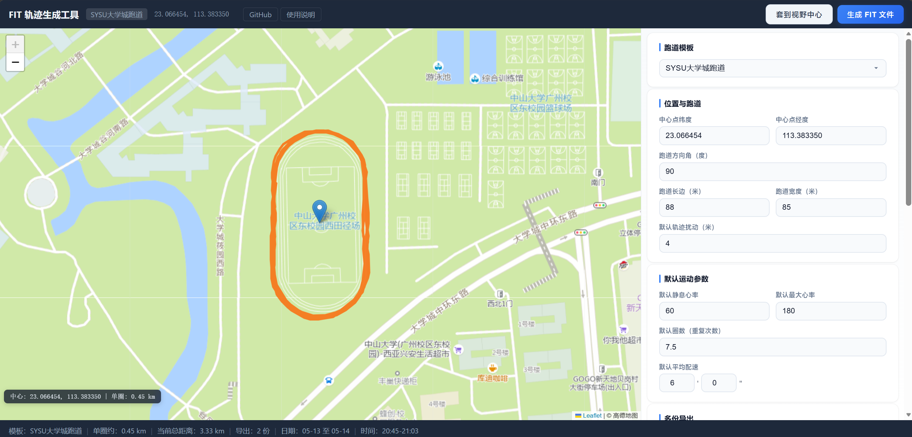
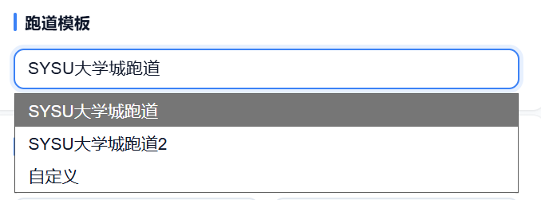
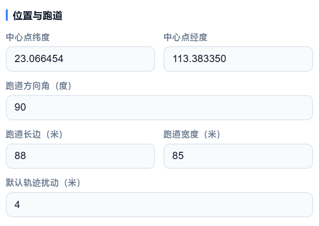
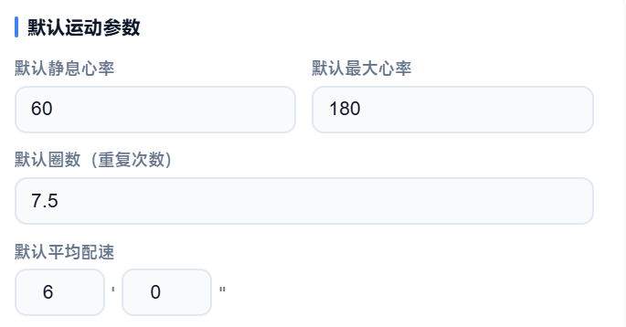
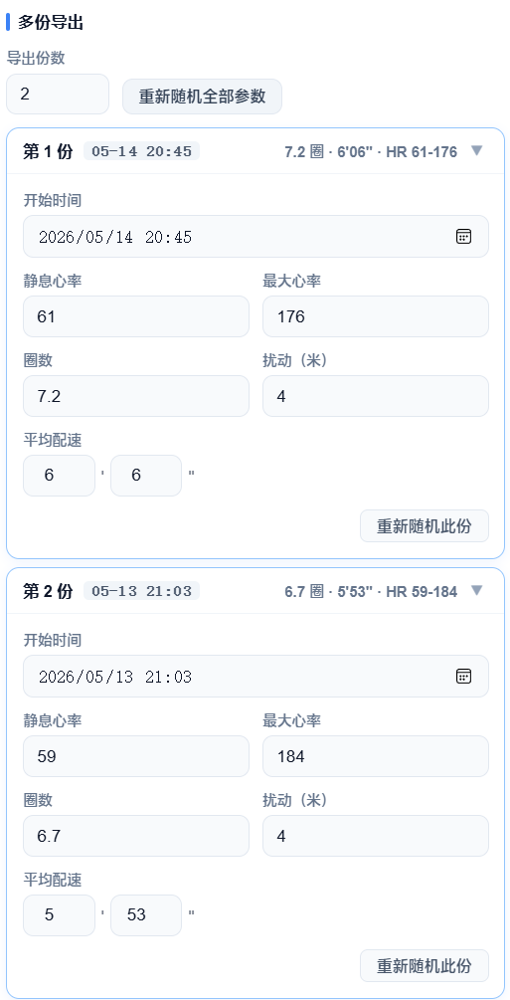

# FIT 轨迹生成工具 — 使用说明

## 简介

FIT 轨迹生成工具是一个基于 Web 的跑步活动 `.fit` 文件生成器。在地图上自动生成标准跑道轨迹，设置运动参数后一键导出 `.fit` 文件，可直接导入 Garmin Connect、Keep、Strava 等主流运动平台。

---

## 界面概览

界面分为四个区域：

| 区域 | 位置 | 功能 |
|------|------|------|
| **顶部状态栏** | 顶部 | 工具名称、当前模板、中心坐标、操作按钮、外部链接 |
| **地图区域** | 左侧 | 高德地图显示，跑道轨迹可视化 |
| **控制面板** | 右侧 | 模板选择、跑道参数、运动参数、多份导出 |
| **底部摘要栏** | 底部 | 模板信息、距离统计、导出份数、时间范围 |

---

## 操作步骤

### 第一步：选择跑道模板

在右侧控制面板的"**跑道模板**"下拉菜单中，选择预设的跑道位置（如 SYSU 大学城等）。

> 你也可以直接在地图上**点击**目标位置，跑道会自动移动到该点。

---

### 第二步：调整跑道参数

在"**位置与跑道**"区域设置以下参数：

| 参数 | 说明 | 示例 |
|------|------|------|
| **中心点纬度** | 跑道中心 WGS-84 纬度 | 23.0513 |
| **中心点经度** | 跑道中心 WGS-84 经度 | 113.3872 |
| **跑道方向角** | 跑道长边朝向（度），0=正北 | 45 |
| **跑道长边** | 直线段长度（米） | 100 |
| **跑道宽度** | 两端半圆的直径（米） | 60 |
| **默认轨迹扰动** | GPS 轨迹随机偏移量（米），模拟真实误差 | 3 |

修改参数后，地图上的轨迹会**实时更新**。

---

### 第三步：设置运动参数

在"**默认运动参数**"区域设置：

| 参数 | 说明 |
|------|------|
| **默认静息心率** | 安静状态下心率（bpm） |
| **默认最大心率** | 运动峰值心率（bpm） |
| **默认圈数** | 绕跑道的重复次数，支持小数 |
| **默认平均配速** | 每公里用时（分'秒"） |

---

### 第四步：配置多份导出（可选）

在"**多份导出**"区域：

1. 设置**导出份数**（1–10 份）
2. 每份文件可独立设置：
   - 活动开始日期和时间
   - 配速
   - 心率
   - 圈数
   - 轨迹扰动
3. 点击"**重新随机全部参数**"可一键随机化所有设置

点击每份文件的标题栏可**展开/折叠**详细参数。

---

### 第五步：生成并下载 FIT 文件

1. 确认所有参数无误
2. 点击顶部状态栏的"**生成 FIT 文件**"按钮
3. 浏览器自动下载 `.fit` 文件（多份导出会依次下载）

---

### 附加功能：套到视野中心

点击"**套到视野中心**"按钮，跑道会自动移动到当前地图视野的中心位置，方便快速定位到目标区域。
